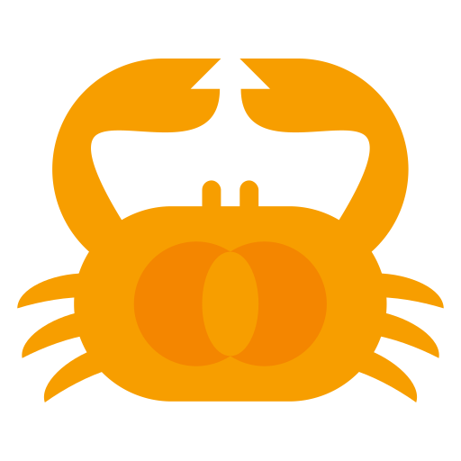

# Crab Fit 

Align your schedules to find the perfect time that works for everyone.
Licensed under the GNU GPLv3.

### ⭐️ Bugs or feature requests

If you find any bugs or have a feature request, please create an issue by <a href="https://github.com/GRA0007/crab.fit/issues/new/choose">clicking here</a>.

### 🌐 Translations

https://explore.transifex.com/crab-fit/crab-fit/

If you speak a language other than English and you want to help translate Crab Fit, visit Transifex using the link above and click "Join this project".

For more information on how to translate, visit the [translating wiki page](https://github.com/GRA0007/crab.fit/wiki/Translating).

---

## Self-hosting

Crab Fit is fully open-source, and you can get your own version running by following the [self-hosting guide](https://github.com/GRA0007/crab.fit/wiki/Self%E2%80%90hosting).

## Contributing

Visit the wiki page for [local development](https://github.com/GRA0007/crab.fit/wiki/Local-Development) to get Crab Fit running locally.

Want to contribute to a pull request? Make sure you read the wiki page on [pull requests](https://github.com/GRA0007/crab.fit/wiki/Pull-Requests) first.
