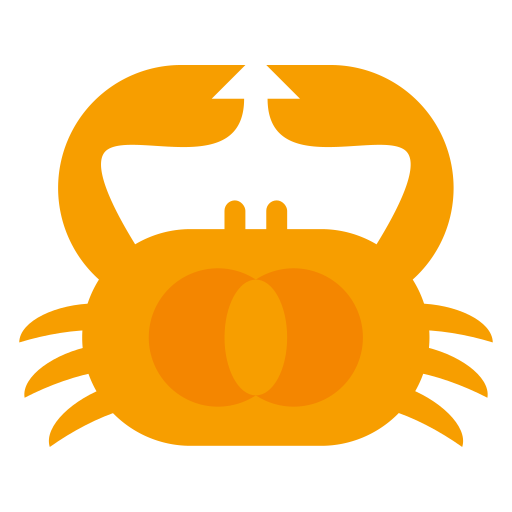

# Crab Fit 

Align your schedules to find the perfect time that works for everyone.
Licensed under the GNU GPLv3.

## Contributing

### ⭐️ Bugs or feature requests

If you find any bugs or have a feature request, please create an issue by <a href="https://github.com/GRA0007/crab.fit/issues/new/choose">clicking here</a>.

### 🌐 Translations

If you speak a language other than English and you want to help translate Crab Fit, fill out this form: https://forms.gle/azz1yGqhpLUka45S9

### Pull requests

If you see an issue you want to fix, or want to implement a feature you think would be useful, please feel free to open a pull request with your changes. If you can, please open an issue about the bug or feature you want to work on before starting your PR, to prevent work duplication and give others a chance to improve your idea.

## Setup

1. Clone the repo and ensure you have `node`, `yarn` and `rust` installed on your machine.
2. Run `yarn` in `frontend` folder to install dependencies, then `yarn dev` to start the dev server.
3. Run `cargo run` in the `api` folder to start the API.

### 🔌 Browser extension

The browser extension in `browser-extension` can be tested by first running the frontend, and changing the iframe url in the extension's `popup.html` to match the local Crab Fit. Then it can be loaded as an unpacked extension in Chrome to test.

## Deploy

Deployments are managed with GitHub Workflows.

To deploy cron jobs (i.e. monthly cleanup of old events), run `gcloud app deploy cron.yaml`.

### 🔌 Browser extension

Compress everything inside the `browser-extension` folder and use that zip to deploy using Chrome web store and Mozilla Add-on store.
